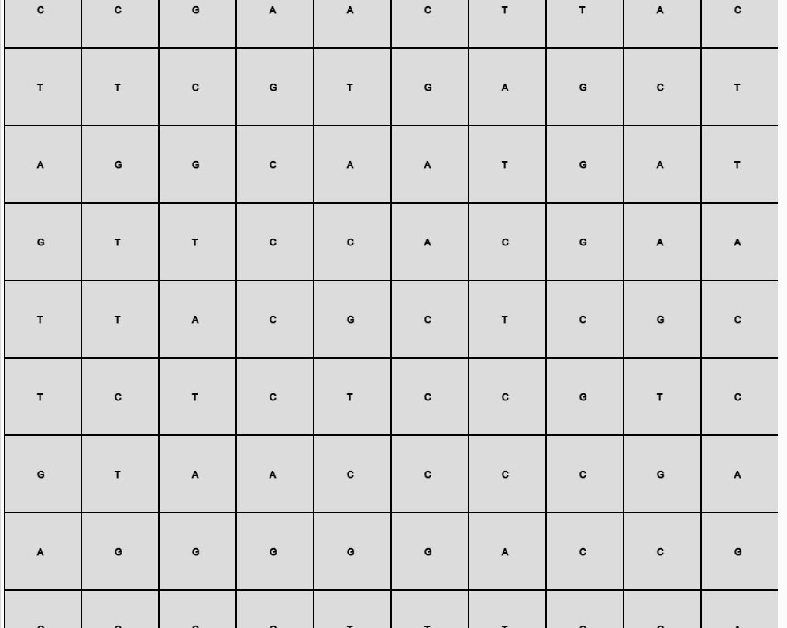
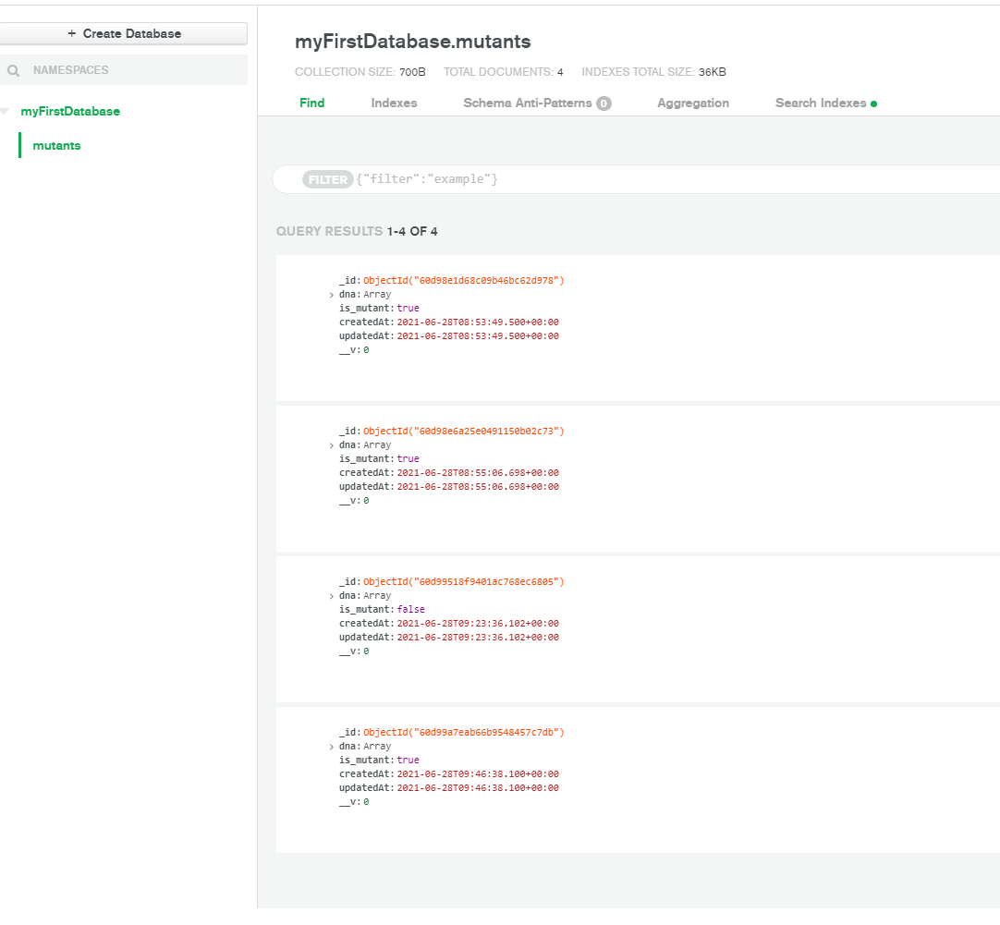

# Detección de mutantes

API de detección de mutantes desarrollado en Nodejs.

## Solución propuesta

### Explicación del algoritmo

El algoritmo presentado en `src/services/HumanService.ts` resuelve la tarea de encontrar 4 secuencias de ADN repetidos de manera vertical, horizontal o diagonal. Esto lo hace recorriendo la matriz y revisando para cada punto actual sus vecinos a la izquierda, abajo, diagonalmente a la derecha y abajo; y diagonalmente abajo y a la izquierda.

Por otro lado, al requerir de una alta demanda en el servicio de `stats`, se implementó un caché local para devolver una respuesta inmediata de las estadísticas actuales de los humanos y los mutantes si este cálculo ya fue realizado. 

### Simulación gráfica del algoritmo planteado


## Documentación API

[https://ml-mutants-318208.ue.r.appspot.com/docs](https://ml-mutants-318208.ue.r.appspot.com/docs)

### Base de datos

- Mutantes



## Uso en ambiente de desarrollo

- El setup de desarrollo está centrado en el uso de Docker y docker-compose para evitar tener que configurar una instancia de MongoDB

1) Instalar Docker [acá](https://www.docker.com/products/docker-desktop).

2) Correr el siguiente comando:
```bash
docker-compose up
```

Esto mantendrá una instancia de MongoDB activa para desarrollo

3) En otro proceso de terminal, instalar las dependencias del proyecto:
```bash
npm install
```

4) Iniciar el proyecto con
  ```bash
npm run dev
```
Este comando automáticamente estará escuchando cambios en el código de Typescript y reconstruirá el javascript generado.

## Uso en Cloud

- El despliegue en producción se hace por medio de Docker compose para reducir la necesidad de configuraciones. El único comando necesario fue 
  ```bash
docker-compose -f docker-compose.prod.yaml up
```

- En producción es necesario ingresar a la página generada por App Engine [acá](https://ml-mutants-318208.ue.r.appspot.com/docs). Ahí se encontrará la explicación de los dos servicios expuestos:

1) POST https://ml-mutants-318208.ue.r.appspot.com/mutant

2) GET https://ml-mutants-318208.ue.r.appspot.com/stats

## Linting

Se configuró el linting con eslint y prettier para estandarizar el estilo del código y hacer formateo automatizado. También se utiliza Husky para hacer formateo antes de subir el código al manejador de versiones.

## Pruebas Unitarias

Se desarrollaron las pruebas unitarias necesarias con Jest, están disponibles en `src/__tests__/test.ts`, y bajo el comando `npm run test`

## License
[MIT](https://choosealicense.com/licenses/mit/)
